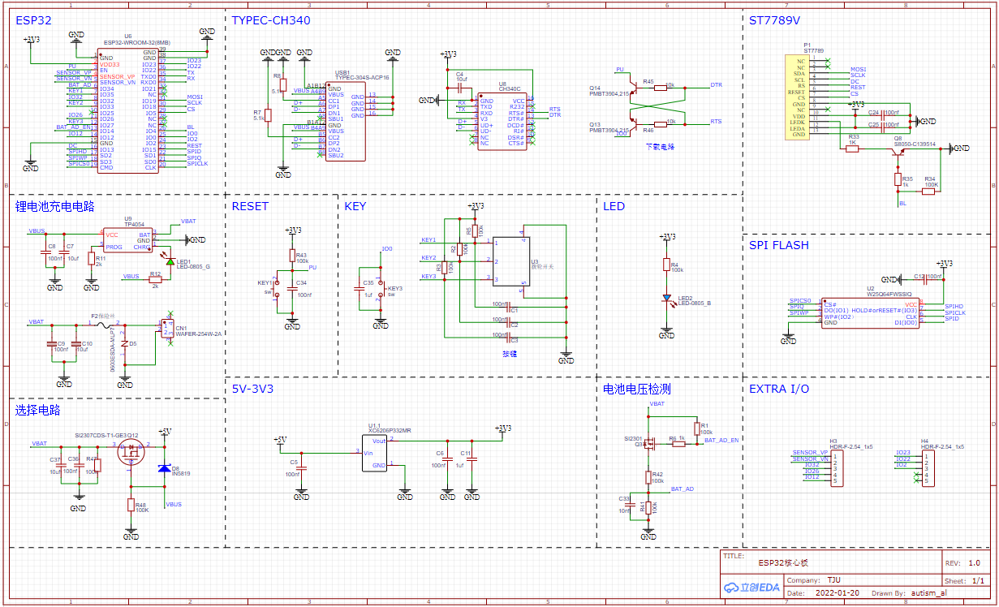
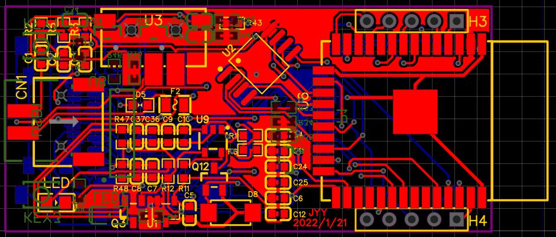
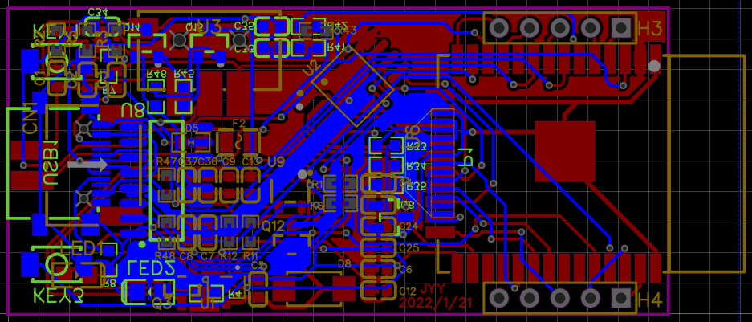
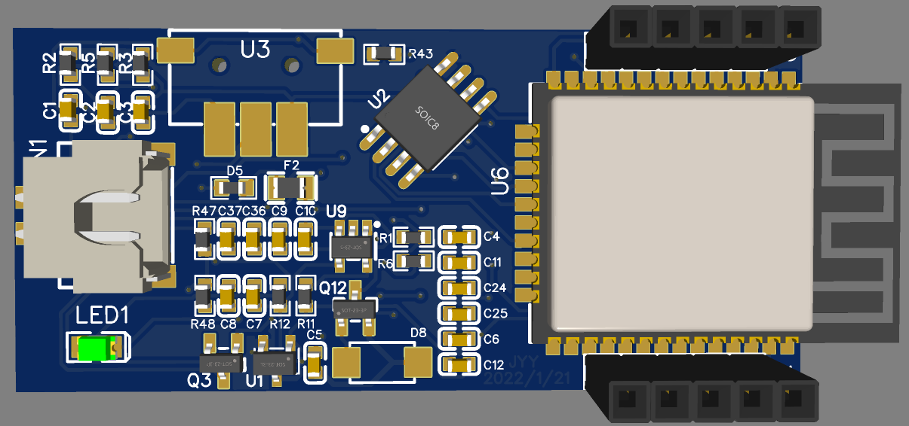
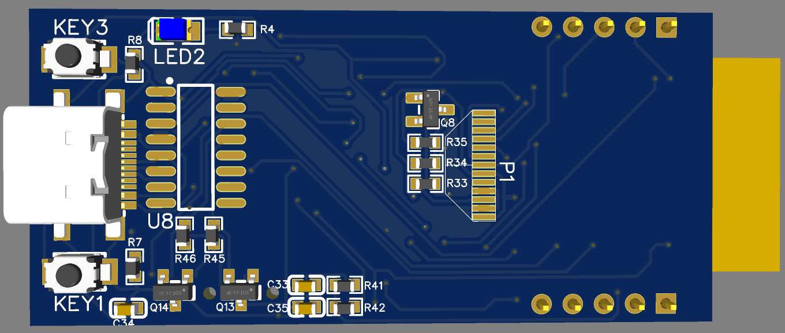

## ESP32核心板

**打造属于自己的超迷你核心板就是说**

该ESP32核心板尺寸仅有**2.5cm*5.5cm**，且板载**1.14寸全彩LCD**，**64Mb SPI Flash**，采用**TypeC**接口以及**锂电池**双供电模式，可实现无线投屏，实时时钟等多项功能。

### 原理图

### PCB

正面

背面

### 3d仿真

正面

背面

### 硬件板载资源

- ESP32（板载天线）
- TypeC接口
- CH340C
- 1.14寸LCD显示屏
- LED
- 轮拨按钮
- 64Mb SPI Flash
- TP4054 锂电池充电管理
- 全I/O引出

### 软件

待开发。。。

### 使用方法：

在编辑器顶部工具栏，点击“文档”图标，选择 “文档” > “打开” > “EasyEDA源码”，选择json文件打开即可。

